# CFGM Sistemes Microinformàtics i Xarxes  

## T05: Anàlisi de l’entorn  
### Possibles models de negoci pels clients tecnològics de la consultoria — FASE 2

**Autor:** Ivan Sicra  
**Data:** 21/10/25  

**Accés al document original:**  
[Google Docs](https://docs.google.com/document/d/1iB2GAZnJliJxNxTZbVtBdWy8oB_JC-oqM-UqHFqtxlo/edit?usp=sharing)

---

## 📚 Índex
1. [Instal·lació del Bitwarden](#instal·lació-del-bitwarden)  
2. [Registre a Bitwarden](#registre-a-bitwarden)  
3. [Pantalla principal](#pantalla-principal)  
4. [Creació de credencials](#creació-de-credencials)  
5. [Addició de l’extensió Bitwarden](#addició-de-lextensió-bitwarden)  
6. [Creació de còpies de seguretat](#creació-de-còpies-de-seguretat)  
7. [Recomanació d’emmagatzematge de còpies](#recomanació-demmagatzematge-de-còpies)  

---

## ⚙️ Instal·lació del Bitwarden
Busco **Bitwarden** al meu navegador i el descarrego.  
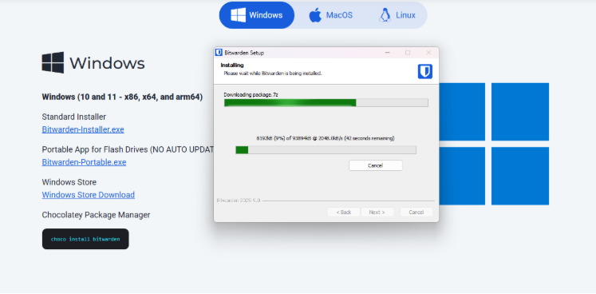

---

## 🧾 Registre a Bitwarden
Em registro i verifico el meu compte amb el correu electrònic que m’envien.  
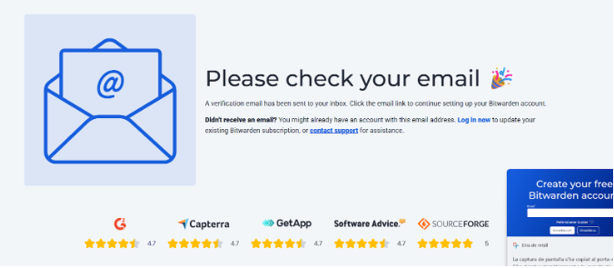
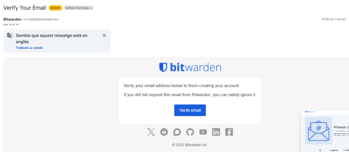
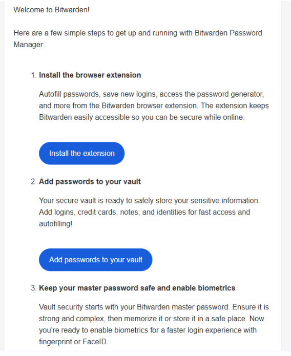

---

## 🖥️ Pantalla principal
Un cop registrat apareixerà aquesta pantalla.  
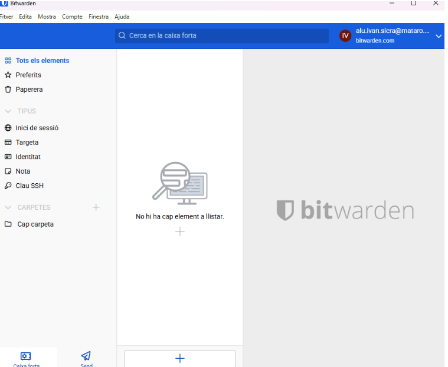

---

## 🔑 Creació de credencials

### Creació d’una credencial per a un compte de correu electrònic
Per crear una credencial d’un **compte de correu electrònic**, faig els següents passos:

1. Faig clic a **“+”**.  
2. Escullo l’opció **“Identitat”**.  
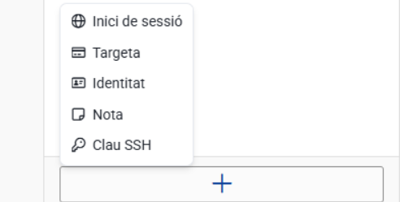

4. Empleno el següent quadre amb la informació corresponent.  
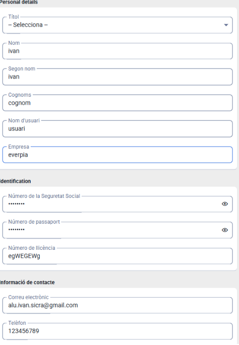

---

### Creació d’una credencial per a una aplicació o servei web
Per crear una credencial d’una **aplicació web o servei web**, faig els següents passos:

1. Faig clic a **“+”**.  
2. Escullo l’opció **“Inici de sessió”**.  
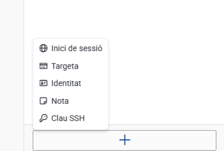

4. Empleno el següent quadre amb la informació de l’aplicació o servei.  
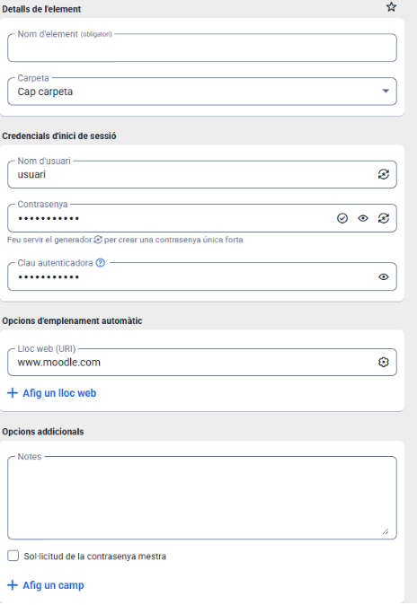

Per afegir una extensió al navegador i que **es desin automàticament les dades**, introdueixo el link del web dins del quadre anterior.
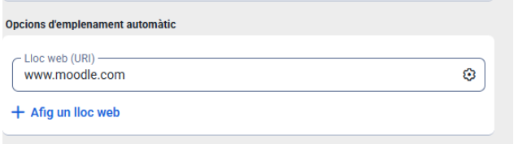

---

## 🧩 Addició de l’extensió Bitwarden
Seguidament afegeixo l'**extensió Bitwarden** a Chrome i vinculo el meu compte de Bitwarden creat anteriorment.  
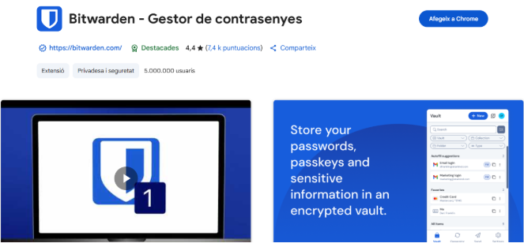
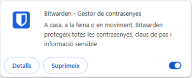
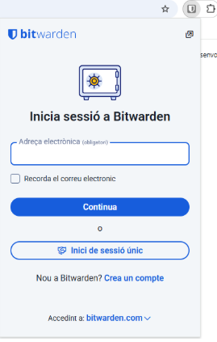

---

## 💾 Creació de còpies de seguretat
Si vull exportar les meves contrasenyes, a les opcions de la part superior de l’aplicació faig:

1. Clic a **“Fitxer”**  
2. I després **“Exporta caixa forta”**  

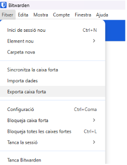
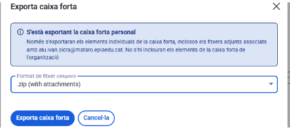

Això permet crear una **còpia de seguretat de totes les contrasenyes** per restaurar-les en cas necessari.

---

## 🔐 Recomanació d’emmagatzematge de còpies
Recomanació sobre la millor forma d’emmagatzemar aquesta còpia de seguretat en format **“.ZIP”**:

- Utilitza un **dispositiu USB extern**.  
- Cerca **BitLocker** al teu Windows (disponible a la versió *Pro*, habitual en entorns empresarials).  
- Escull aquesta unitat USB per **xifrar-la**.  

Un cop xifrat, només podràs accedir al contingut —és a dir, al fitxer “.ZIP”— introduint una **contrasenya segura que no pots oblidar**.  
Aquesta mesura garanteix la **confidencialitat i seguretat** de les còpies de seguretat.

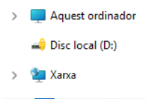
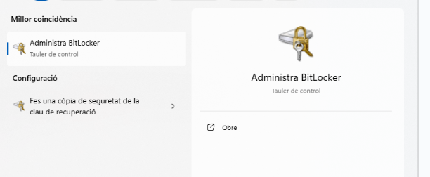
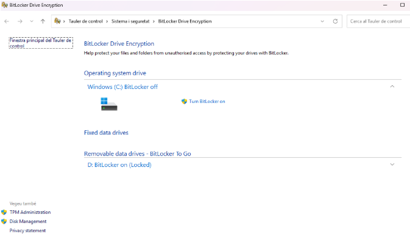

---

> 📄 *Document elaborat com a part del mòdul d’Anàlisi de l’entorn (FASE 2) – CFGM Sistemes Microinformàtics i Xarxes.*

