Durant la instal·lació del servidor he configurat el nom d’usuari, el nom del servidor i la contrasenya.

Actualitzo els paquets de la màquina virtual.

Configuro el nom i el domini del servidor.

Instal·lo OpenLDAP mitjançant la següent comanda

Un cop instal·lat s’obrira la següent pantalla, ens demana posar una contrasenya.

Comprovo que el servei està funcionant.

Comprovo que el directori s’ha creat amb el nom que volia.

Si el nom del directori no es el que volia faig la comanda “dpkg-reconfigure slapd”, la qual m’obrira la pantalla a continuació. Primer de tot diem que no volem cancelar la configuració de la BDD.

Posem el nom corresponent al directori que volem crear.

Poso el nom de la organització.

Configuro la contrasenya d'administrador novament: p@ssw0rd.

Indica que quan s'elimini el paquet, també s’esborri la BD creada.

Comprovo com s’ha modificat la informació de directori.

Creo un nou arxiu “.ldif”.

dins d’aquest arxiu escric el següent contingut i creo dos nous objectes, 2groups” i “users”.

Declaro els dos nous objectes al directori que acabo de crear amb l’ajuda de l’eina “ldapadd”.

Mitjançant la comanda “ldapsearch” comprovo que els objectes s’han creat correctament dins del directori.

Instalar LDAP account manager amb aquesta comanda:

Edito el arxiu netplan i configuro la ip, posaré dhcp en activat per a que crei una ip de forma automatica.

Aplico els canvis que he fet en el document de netplan.

Comprovo quina ip automatica m’ha creat el sistema mitjançant la comanda “ip a”.

Obro “192.168.56.101/lam” premo TAB i obrira una pantalla de control de LDAP Account Manager.

configuro la meva contraseña: lam.

Un cop dins em trobaré aquesta pantalla de configuració.

Dins de la pàgina de configuració anterior cambio el idioma.

Configuro l’usuari d’administrador.

Vaig a l’apartat de “Acoount types” dins de la pantalla de configuració anterior i cambio el sou dels users i groups.

Creo un grup.

Creo un usuari

Afegeixo un usuari de Unix a l'usuari prèviament creat.

Configuro una contrasenya al usuari.

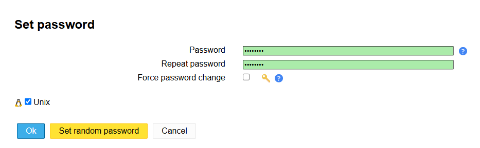

Faig click a “save” i guardo l’usuari.

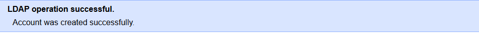

Creo la maquina client en Zorin i poso dos adaptadors de xarxa, el NAT i el Host-only.

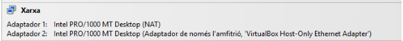

Creo una snapshot de la maquina.

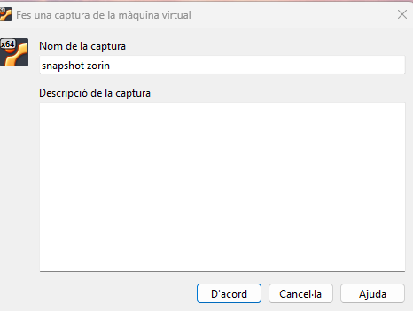

Edito la configuració de l’arxiu de Hosts

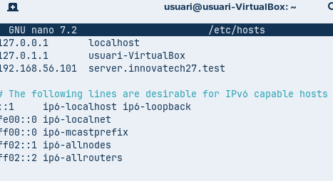

Configuro el ldap amb la comanda: “ sudo apt install libnss-ldap libpam-ldap ldap-utils nscd -y”.

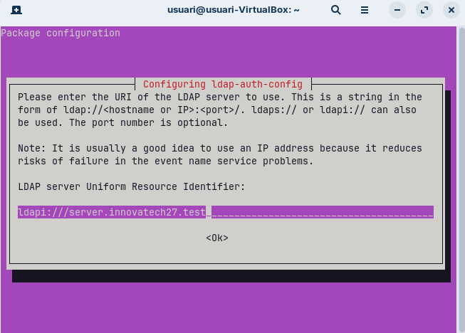
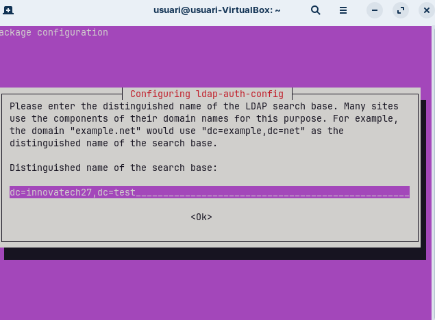
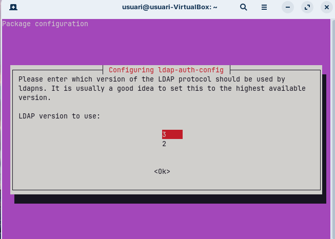
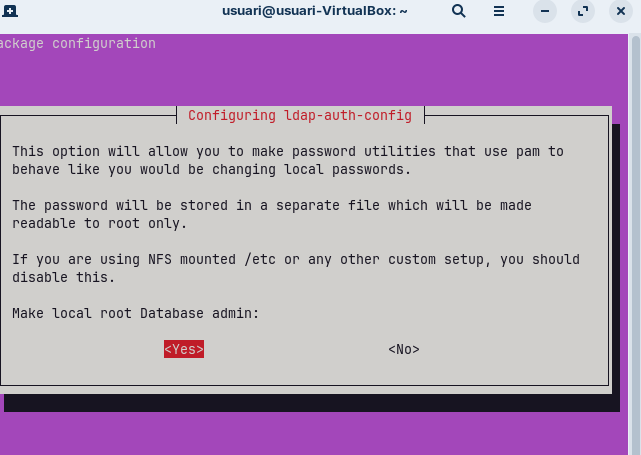
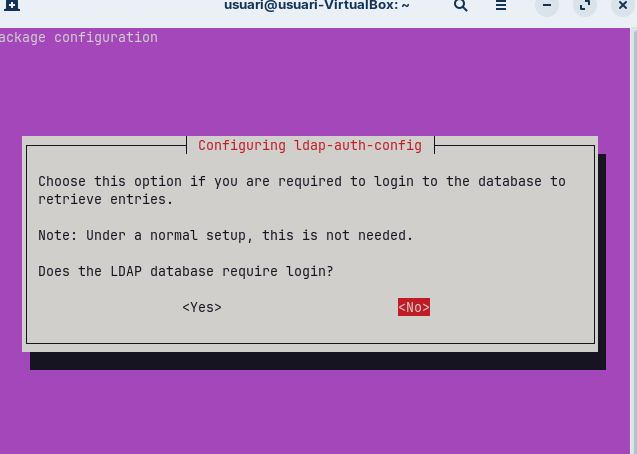

Comprovo la connexió.

Configuro l’arxiu “nsswitch.conf”.

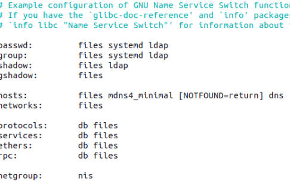

Configuro l’arxiu /etc/pam.d/common-password.

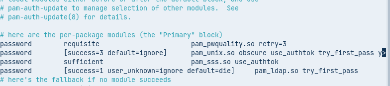

configuro l’arxiu /etc/pam.d/common-session.

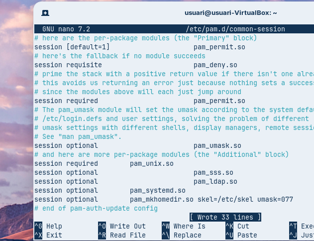

Reinicio el servei

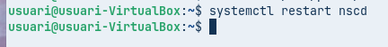

Configuro l’arxiu /etc/pam.d/gdm-launch-environment.

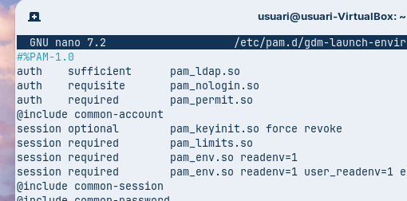
