# Instal·lació i configuració del servidor amb OpenLDAP

## Configuració inicial

Durant la instal·lació del servidor he configurat el **nom d’usuari**, el **nom del servidor** i la **contrasenya**.

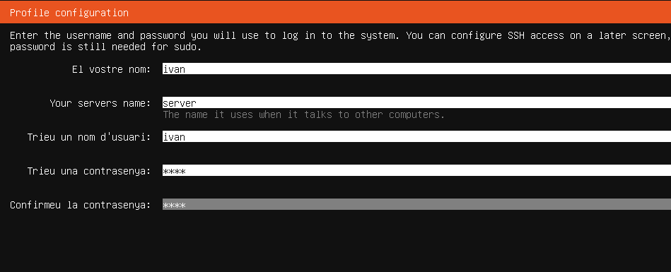

Actualitzo els paquets de la màquina virtual.

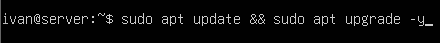

Configuro el **nom** i el **domini** del servidor.

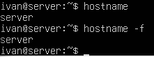

---

## Instal·lació d’OpenLDAP

Instal·lo **OpenLDAP** mitjançant la següent comanda.


Un cop instal·lat, s’obrirà la següent pantalla i ens demanarà posar una **contrasenya**.

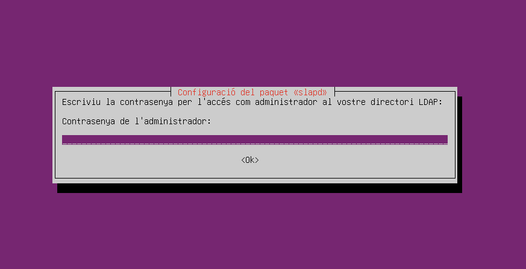

Comprovo que el **servei està funcionant**.

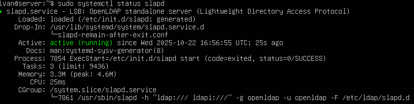

Comprovo que el **directori s’ha creat** amb el nom que volia.

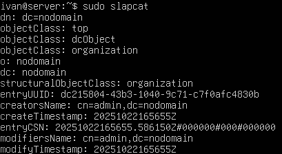

Si el nom del directori no és el correcte, faig servir la comanda:

```bash
dpkg-reconfigure slapd
```

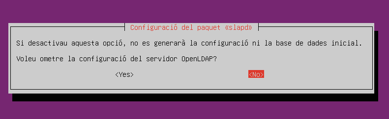

Aquesta comanda obrirà una pantalla de configuració.  

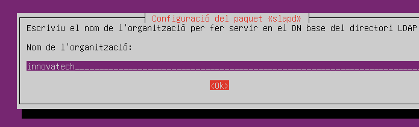

Primer de tot diem que **no volem cancel·lar la configuració de la BDD**.

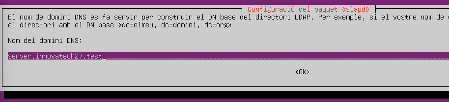

Posem el **nom corresponent al directori** que volem crear.

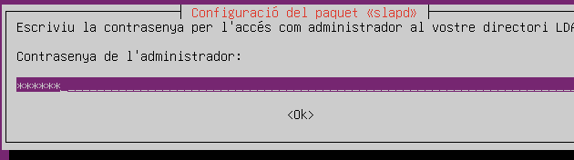

Poso el **nom de l’organització**.


Configuro la **contrasenya d’administrador novament**:  
`p@ssw0rd`

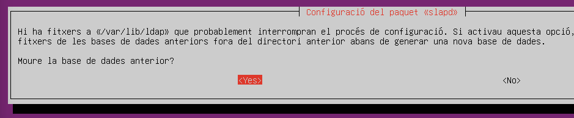

Indico que quan s’elimini el paquet, també s’esborri la BD creada.

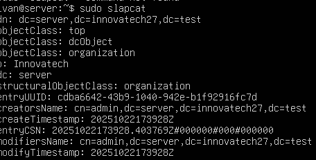

Comprovo com s’ha modificat la informació del directori.

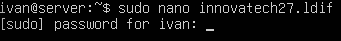

---

## Creació de fitxer `.ldif`

Creo un nou arxiu `.ldif`.

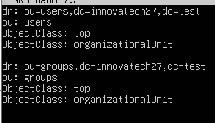

Dins d’aquest arxiu escric el següent contingut i creo dos nous objectes:  
**groups** i **users**.

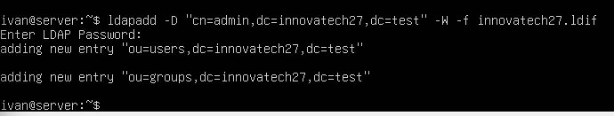

Declaro els dos nous objectes al directori amb l’ajuda de l’eina **ldapadd**.

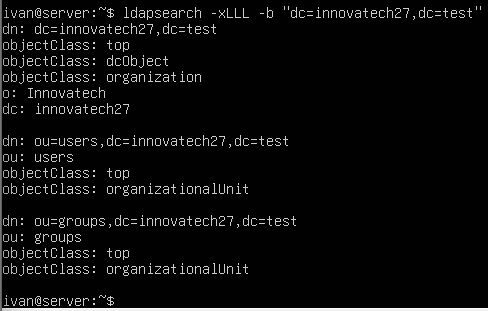

Mitjançant la comanda següent comprovo que els objectes s’han creat correctament dins del directori:

```bash
ldapsearch
```

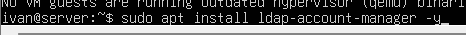

---

## Instal·lació de LDAP Account Manager

Instal·lo **LDAP Account Manager** amb aquesta comanda.

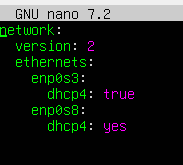

---

## Configuració de la xarxa (Netplan)

Edito l’arxiu **Netplan** i configuro la IP, posant **DHCP** activat perquè creï una IP automàticament.


Aplico els canvis que he fet al document de Netplan.

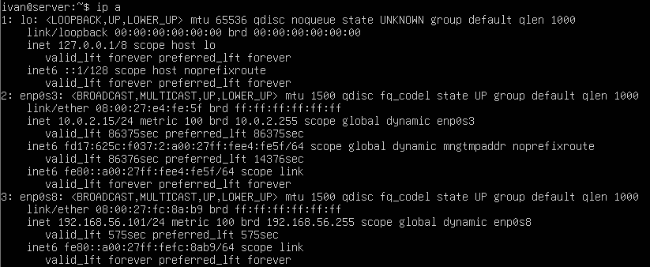

Comprovo quina IP automàtica ha creat el sistema amb la comanda:

```bash
ip a
```

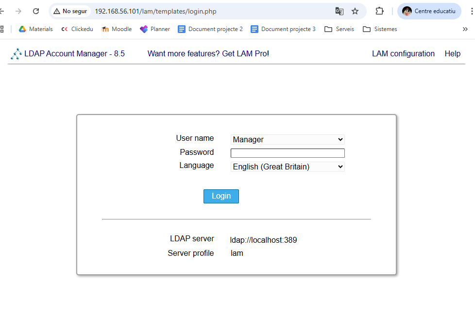

---

## Accés a LDAP Account Manager

Obro el navegador i accedeixo a:

```
192.168.56.101/lam
```

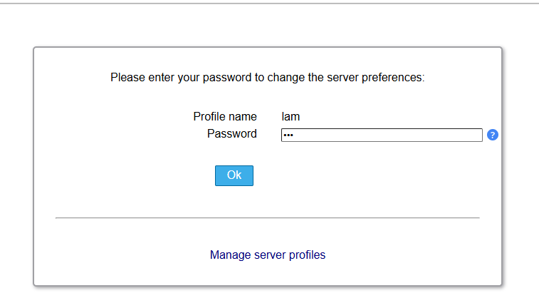

Premo **TAB** i s’obrirà la pantalla de control de **LDAP Account Manager**.

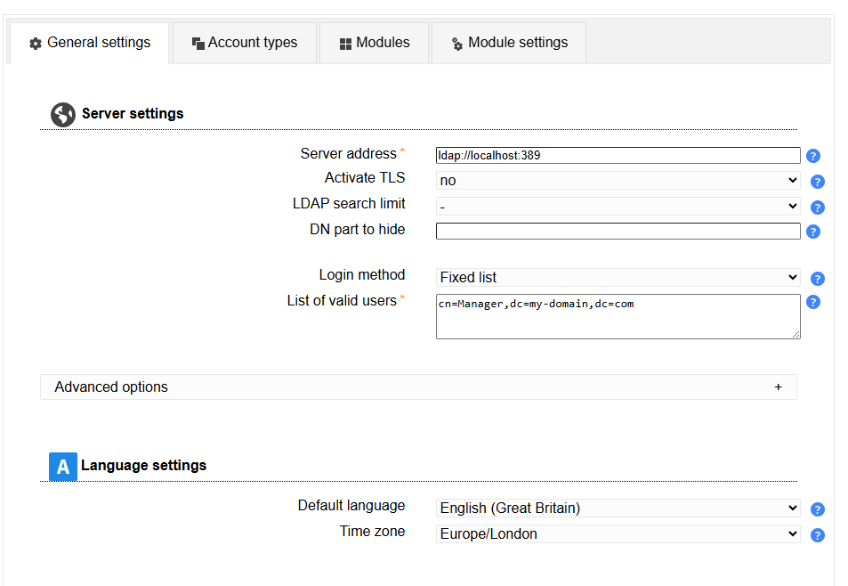

Configuro la meva contrasenya:  
`lam`

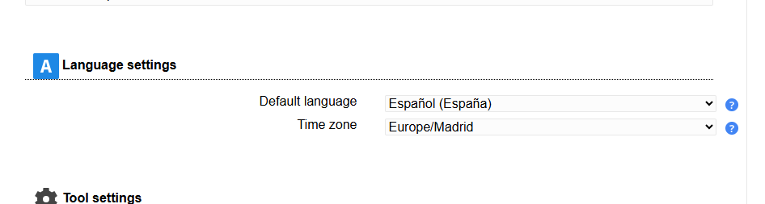

Un cop dins, em trobaré la pantalla de **configuració**.

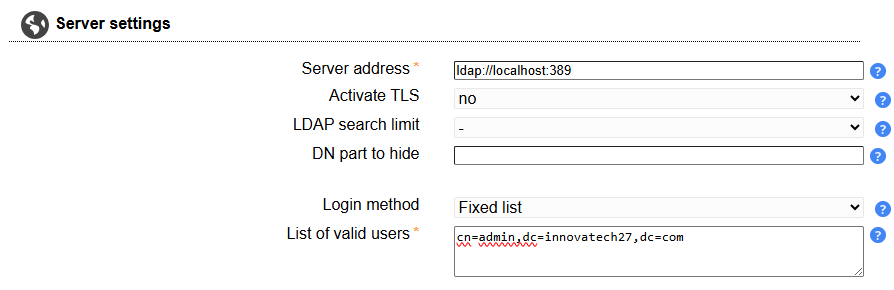


---

## Configuració inicial a LDAP Account Manager

Dins de la pàgina de configuració:

- Canvio l’**idioma**.

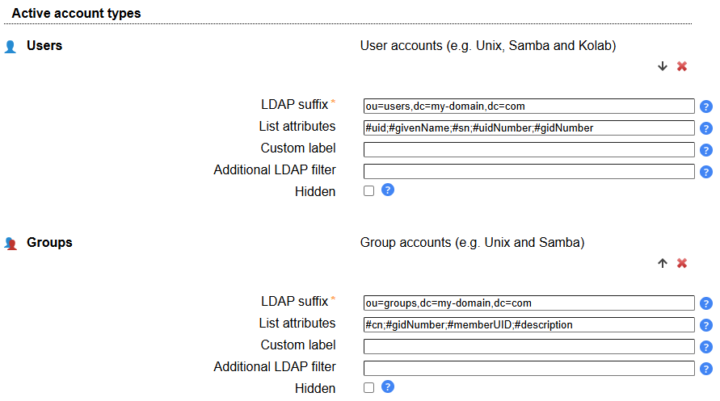

- Configuro l’**usuari d’administrador**.

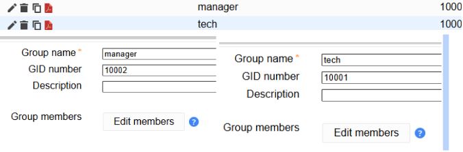

- A l’apartat **Account types**, canvio el *sou* dels **users** i **groups**.


---

## Creació d’usuaris i grups

Creo un **grup**.

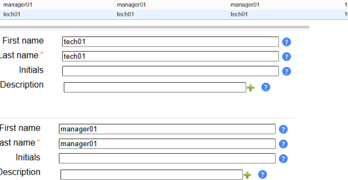

Creo un **usuari**.

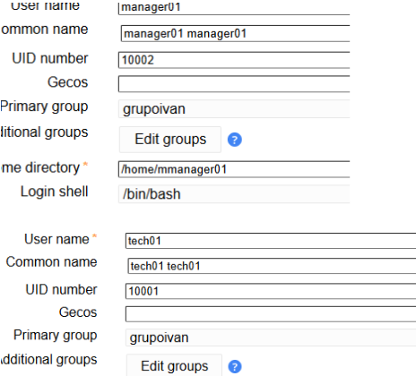

Afegeixo un **usuari de Unix** a l’usuari prèviament creat.

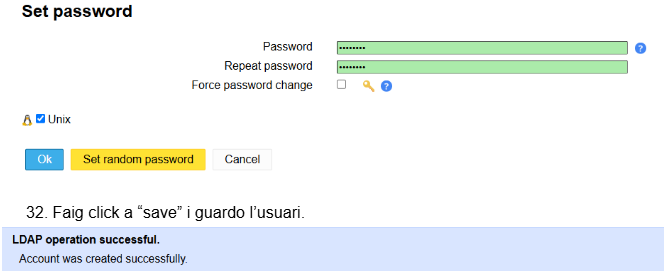

Configuro una **contrasenya** per a l’usuari.


Finalment, faig clic a **Save** i guardo l’usuari.


