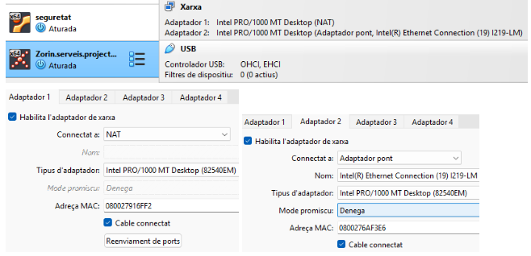
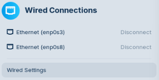
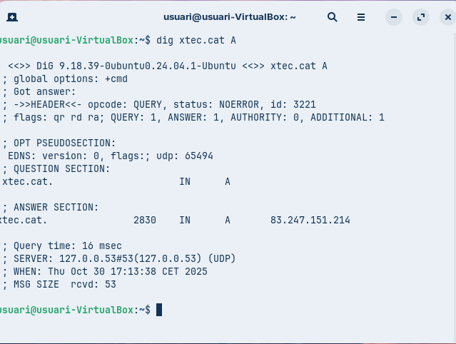
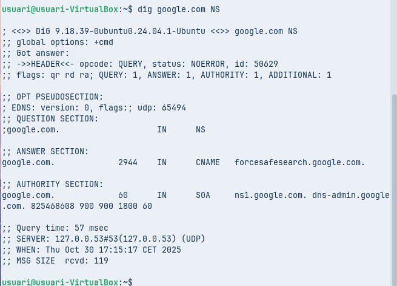
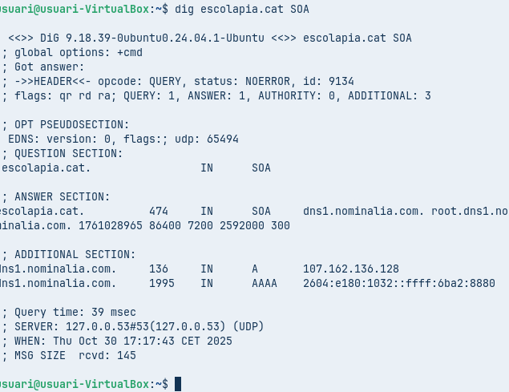
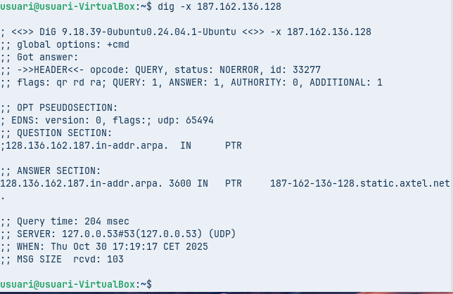
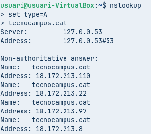
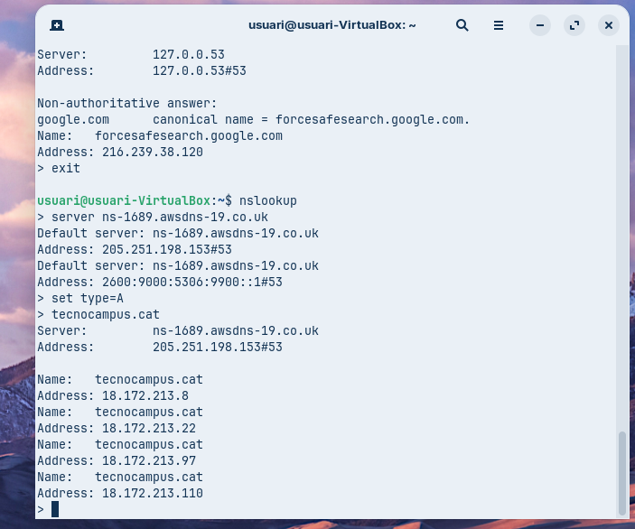
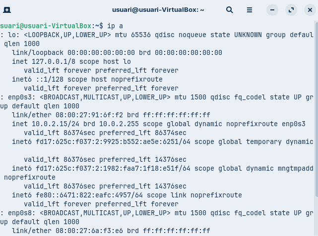

## 1. Configuro dos ports de xarxa, un principal en “NAT”, i un secundari en “Pont”.

## 2. Activo el port ethernet “Pont”.

## 3. Configuro IP i màscara.

## 4. Comprovo la connexió.

## 5. Faig una consulta amb la comanda “dig”:

5.1. Consulta bàsica de registre: “A”

5.2. Consulta de servidor de noms: “NS”

5.3. Consulta detallada: “SOA”

5.4. Consulta resolució inversa.

## 6. Consulta no autoritativa.

## 7. Consulta autoritativa.

La Principal diferencia entre una consulta no autoritativa i una consulta autoritativa, es que l’apartat de resposta “Non-authoritative answer” no apareix quan la consulta es autoritativa.
